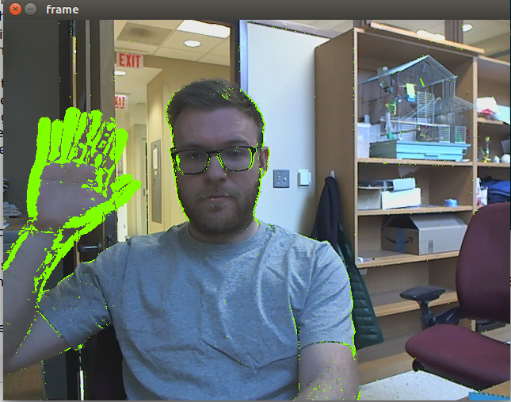

# motion-detect

Realtime motion detection using [OpenCV](http://opencv.org/).

Input can be a webcam or a saved video file.

## Requirements
Python, Numpy and OpenCV.

Note: may not work well with [Anaconda](https://store.continuum.io/cshop/anaconda/)'s opencv package because
codecs are not included.

In Ubuntu/Debian:
`sudo apt-get install python-numpy python-opencv`

## Installation

`python setup.py install`

Alternately, just place the file `motion-detect` in your path, or simply run the script directly, e.g.

    git clone https://github.com/kylerbrown/motion-detect.git
    cd motion-detect
    ./motion-detect

## Usage
For usage help, type `motion-detect -h`

